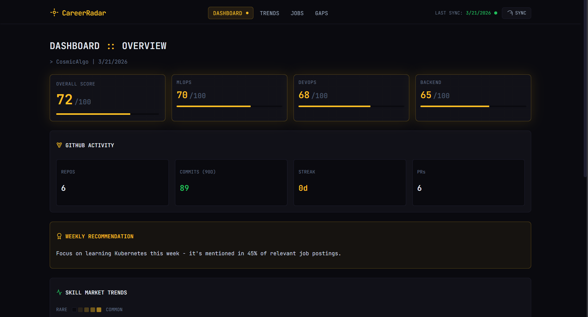

# CareerRadar

> Daily career intelligence dashboard — know exactly where you stand in today's job market.

CareerRadar analyzes your GitHub profile, scrapes real-time job postings every morning, and uses Gemini Flash to score your profile against the market. Every day you get a **weighted match score**, a **radar coverage chart**, and a list of jobs you actually qualify for.



---

## 🚀 The Core Innovation: Evidence-Based Assessment

Most career tools use static keywords. CareerRadar uses a **Weighted Semantic Engine**:

1.  **GitHub Ingestion:** Reads your actual code complexity, repository topics, and commit patterns via GraphQL.
2.  **Market Pulse:** Scrapes fresh distributions of job postings (JSearch, Apify, Playwright).
3.  **Weighted Scoring (70/30):** Your score reflects your primary strength (70%) combined with your versatile breadth (30%), moving away from biased averages.
4.  **Radar Gap Analysis:** Proportional radar charts that shrink specifically where the AI detects a concrete skill gap in your portfolio relative to current market demand.

---

## ✨ Features

- **Weighted Profile Scoring** — Predictive engine favoring your top-performing roles (ML Engineer, MLOps, DevOps, etc.).
- **Proportional Radar Chart** — Dynamic visual representation of your market coverage vs. skill gaps.
- **Job Application Tracker** — Built-in kanban-style tracking for your applications and follow-ups.
- **CV Analysis** — Upload your PDF resume to receive an AI-powered gap analysis against your target roles.
- **Public Demo Mode** — Industry-standard security lockdown. Set `PUBLIC_DEMO_MODE=true` to deploy as a read-only portfolio piece without risking your API quotas.
- **Advanced Config** — Custom role and location inputs with strict validation (1 Remote + 2 arbitrary text locations).
- **Zero AI cost** — Optimized for Gemini Flash 2.5 free tier.

---

## 🛠️ Tech Stack

| Layer           | Technology                                                           |
| --------------- | -------------------------------------------------------------------- |
| **Frontend**    | Next.js 14 (App Router) + SWR + Lucide Icons + Bloomberg Terminal UI |
| **Backend**     | FastAPI + Pydantic v2 + APScheduler                                  |
| **Database**    | Supabase (PostgreSQL)                                                |
| **AI Matching** | Gemini Flash 2.5 (JSON Mode) + Cosine Similarity                     |
| **Scraping**    | JSearch (RapidAPI) + Apify + Playwright                              |
| **GitHub**      | GraphQL API v4                                                       |
| **Deployment**  | Vercel (Frontend) + Railway/Render (Backend)                         |

---

## 📦 Getting Started

### Prerequisites

- Python 3.10+ & Node.js 18+
- [Supabase](https://supabase.com) Account (Postgres storage)
- [Google AI Studio](https://aistudio.google.com) Key (Gemini Flash)
- GitHub PAT (read-only access)

### 1. Local Setup

```bash
git clone https://github.com/CosmicAlgo/Career.git
cd Career
bash start.sh
```

### 2. Configure Environment

Create a `.env` in the root (see `.env.example` for full list):

```ini
GITHUB_TOKEN=ghp_...
GITHUB_USERNAME=your-username
GOOGLE_AI_API_KEY=AIza...
SUPABASE_URL=https://xxx.supabase.co
SUPABASE_SERVICE_ROLE_KEY=eyJ...
PUBLIC_DEMO_MODE=false # Set to true for public deployments
```

---

## 🚢 Deployment Guide

### Backend (Railway / Render)

1.  Create a new project from your GitHub repo.
2.  Set the **Root Directory** to `/backend`.
3.  Add your environment variables.
4.  Railway will automatically detect the `Dockerfile` and deploy.

### Frontend (Vercel)

1.  Import your GitHub repo.
2.  Set the **Root Directory** to `/frontend`.
3.  Add `NEXT_PUBLIC_BACKEND_URL` pointing to your deployed backend.
4.  Deploy.

---

## 🔒 Security: Public Demo Mode

When deploying as a portfolio piece for recruiters:

1.  Set `PUBLIC_DEMO_MODE=true` on the backend.
2.  This automatically enables **FastAPI Dependency Injection** to block all mutating endpoints (`POST`, `PUT`, `DELETE`).
3.  The Frontend UI will display a **Read-Only** badge and disable sync/save buttons to prevent strangers from overwriting your data or exhausting your API credits.

---

## 📈 Roadmap

- [x] CV/Resume Upload & Matching
- [x] Application tracker & Stats
- [ ] Email Daily Digest (Resend/SendGrid)
- [ ] Multi-user Authentication (Supabase Auth)
- [ ] Interview prep assistant based on local job matches

---

## 📄 License

MIT — build on it, fork it, get hired.

_Built by [Rahul Surya](https://github.com/CosmicAlgo) — MSc HPC & Data Science, University of Edinburgh_
